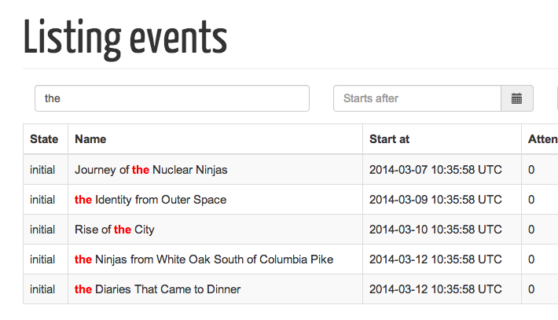

class: center, middle

# Dekoratory

---

## Czym są dekoratory?

> Wzorzec dekoratora polega na opakowaniu oryginalnej klasy w nową klasę "dekorującą". Zwykle przekazuje się
> oryginalny obiekt jako parametr konstruktora dekoratora, metody dekoratora wywołują metody oryginalnego
> obiektu i dodatkowo implementują nową funkcję.

> Dekoratory są alternatywą dla dziedziczenia. Dziedziczenie rozszerza zachowanie klasy w trakcie kompilacji,
> w przeciwieństwie do dekoratorów, które rozszerzają klasy w czasie działania programu.

.right[_Wikipedia_]

---
class: middle

## Kiedy korzystamy z dekoratorów?

* gdy chcemy odpowiednio sformatować datę do wyświetlenia
* gdy chcemy wygenerować część interfejsu bazującą na danym obiekcie
* gdy chcemy wyświetlić nazwy powiązanych obiektów

---

## Korzystanie z dekoratora

1. Dodajemy `gem 'draper'` do Gemfile lub `gem install draper`

2. Następnie generujemy dekorator dla istniejącej klasy, np: `rails g decorator Event`

3. Definiujemy nową metodę w dekoratorze i dodajemy jej wywołanie w widoku

4. Dekorujemy obiekt w kontrolerze, np. poprzez dodanie expose: `expose(:decorated_events){ filtered_events.decorate }`

5. Wykorzystujemy udekorowaną kolekcję w widoku

---

## Zadanie

**Na brązowy rubin:**
W widoku `events/show` wyświetl listę ('po przecinku') osób zaproszonych do udziału w spotkaniu.

**Na srebrny rubin:**
Utwórz `ApplicationDecorator` z którego dziedziczyć będą pozostałe dekoratory. Zaimplementuj w nim metody `show_link`,
`edit_link` oraz `destroy_link`, które utworzą odpowidnie odnośniki. Wykorzystaj te metody w widokach. Przy
implementowaniu metody `edit_link` może być przydatna znajomość helpera `url_for`.

**Na złoty rubin:**
Spraw, by znaleziona w nazwie spotkania fraza została wyróżniona. Do tego celu możesz wykorzystać wyrażenia regularne,
metodę `gsub`. Aby wygenerowany w dekoratorze markup html był poprawnie zinterpretowany przez przeglądarkę możesz
skorzystać z metody `raw` lub `html_safe`. Wizualizacja końcowego efektu na następnym slajdzie.

---

## Zadanie

